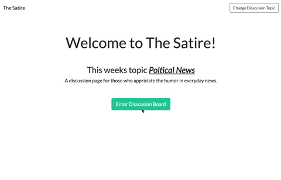
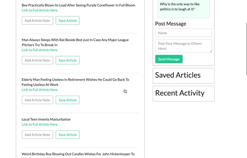
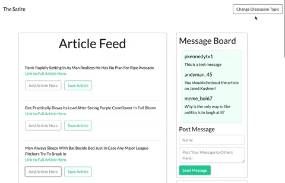

# The Satire 

This project is **not a production application** but designed to demonstrate scraping and compilation of data from other websites. This build also shows the use of a non-realtional database (MongoDB) to handle the scrapped data. In this case the application is designed to be a weekly update where people can discuss politics in a more comical atmosphere. This update is actually a administrator scraping the Onion political satire news based on a category defined by the URL. There is a commenting section and places to add notes for each article. 

There are features not added on this build that would be added to an actual production build of this site. Those would include: User login, realtime updates for the commenting section, and additional commenting section for each article, and the ability to share articles on various social media. 

## Getting Started

### Prerequisites

To run this application you are going to need [Node.js](https://nodejs.org/en/download/) and the following in the terminal command line:

```
npm init
```

### Installing

The following npm packages are required:

```
npm install express --save
npm install body-parser --save
npm install morgan --save
npm install mongoose --save
npm install express-handlebars --save
npm install socket.io --save
```

## Running the Application

To begin the application paste the following in the terminal.

```
npm start
```

You click into the feed like so.



Then if you want to mess around you can add links to the favorites and even have notes save.
All of this activity will be logged in the activity tracker.



Then you can go to the 'change disscusion board' button and pick which one to talk about next. It will scrape a different part of the site.



## Deployment

When you are deploying this application to heroku the mongodb needs to be connected to your heroku app. When creating your new herko app be sure to run the following command:

```
heroku addons:create mongolab
```

This will give you schemas something to create to. 

## Built With 

*[Bootstrap](https://getbootstrap.com/docs/4.1/examples/)
*[Express](https://expressjs.com/)